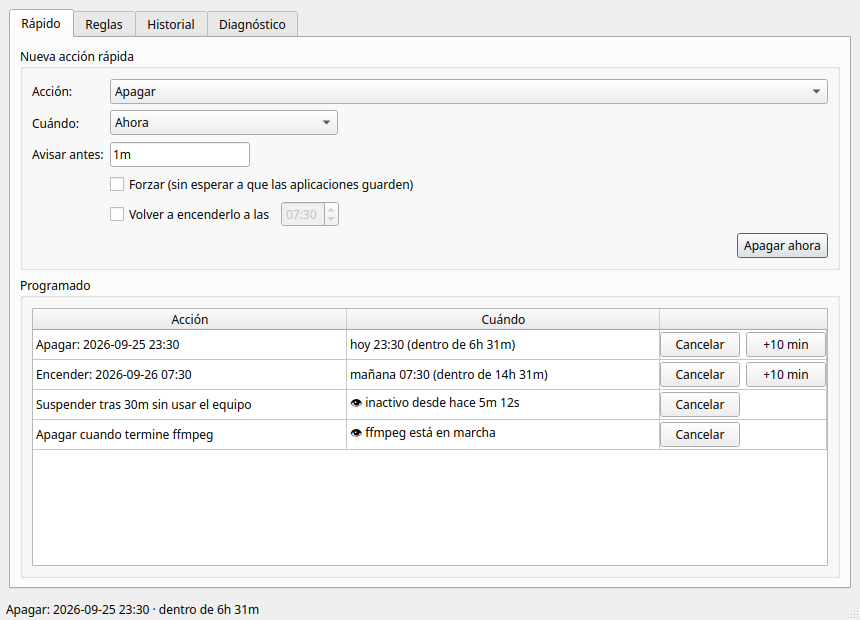
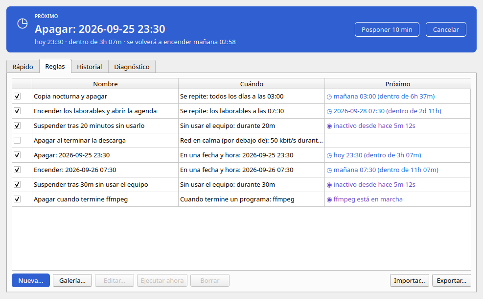
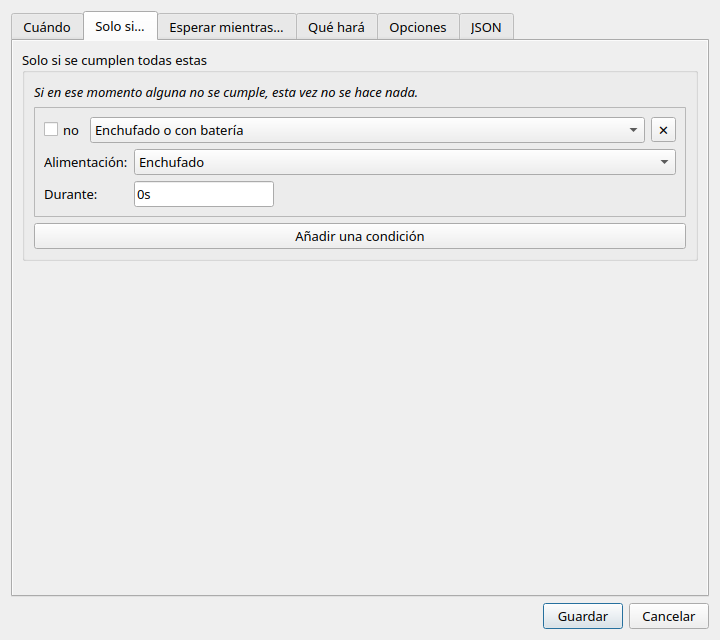
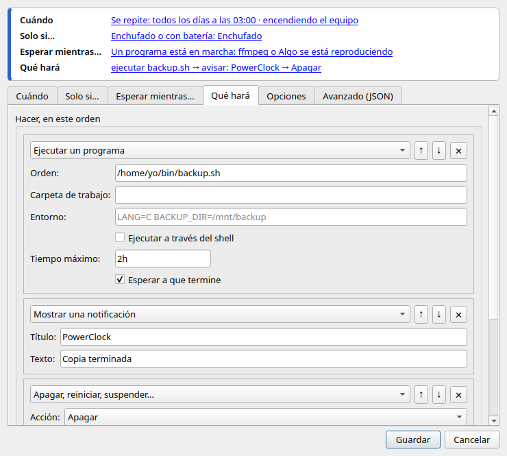
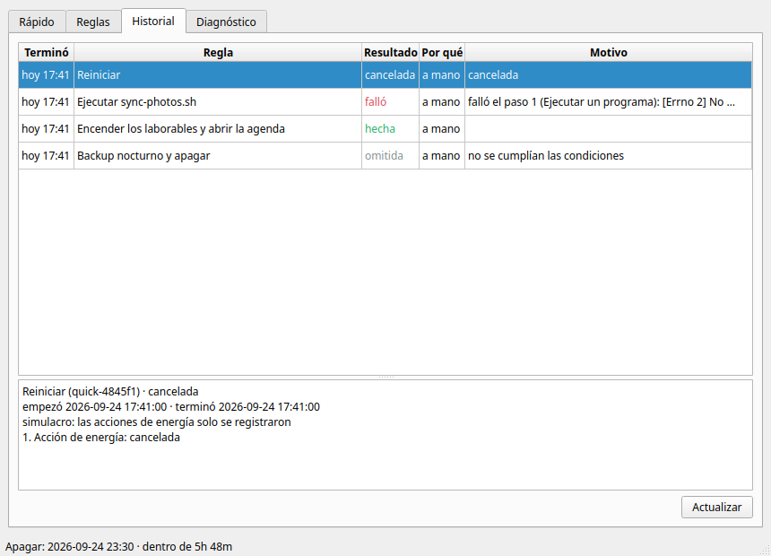
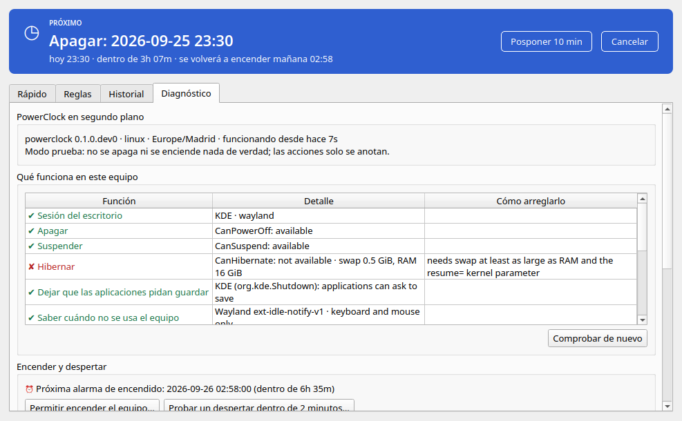
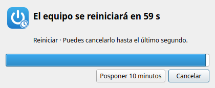
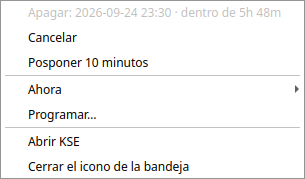

# KShutdown Evolution (`kse`)

[English](README.md) · **Español**

> **Estado:** versión previa (se prepara la 0.1.0). Hoy funciona en Linux; Windows y macOS están
> previstos. No tiene relación con [KShutdown](https://kshutdown.sourceforge.io/), que lo inspiró.

KSE apaga, reinicia, suspende, hiberna, bloquea, cierra la sesión y **enciende tu equipo** por sí
solo, y ejecuta tus programas y scripts, **a una hora, de forma periódica o cuando pasa algo**:
nadie está usando el equipo, ha terminado un render o una descarga, queda poca batería, se ha
desenchufado el portátil…

Lo hace con **reglas persistentes** que guarda un pequeño servicio en segundo plano (el
*demonio*). Las reglas siguen funcionando con la ventana cerrada, después de reiniciar e incluso
sin nadie con la sesión iniciada. Puedes manejarlo desde un **icono en la bandeja y una ventana**
(al estilo de KShutdown), desde la **línea de comandos** o desde cualquier programa a través de un
**API local**.



---

## Contenido

- [Qué puede hacer](#qué-puede-hacer)
- [Capturas](#capturas)
- [Requisitos](#requisitos)
- [Instalación](#instalación)
- [Empezar en cinco minutos](#empezar-en-cinco-minutos)
- [Cómo funciona: las ideas principales](#cómo-funciona-las-ideas-principales)
- [La interfaz gráfica](#la-interfaz-gráfica)
- [La línea de comandos](#la-línea-de-comandos)
- [Las reglas en detalle](#las-reglas-en-detalle)
- [Encender y despertar el equipo](#encender-y-despertar-el-equipo)
- [Condiciones y sensores](#condiciones-y-sensores)
- [Seguridad](#seguridad)
- [Uso en un servidor](#uso-en-un-servidor)
- [Archivos y ajustes](#archivos-y-ajustes)
- [El API local](#el-api-local)
- [Solución de problemas](#solución-de-problemas)
- [Desinstalar](#desinstalar)
- [Desarrollo](#desarrollo)
- [Hoja de ruta](#hoja-de-ruta)
- [Licencia](#licencia)

---

## Qué puede hacer

**Acciones de energía**

| Acción | Qué ocurre |
|---|---|
| Apagar | Apaga el equipo. Por defecto de forma *ordenada*: el escritorio pide antes a las aplicaciones abiertas que guarden (KDE y GNOME). |
| Reiniciar | Reinicia, también de forma ordenada por defecto. |
| Suspender | Suspensión en RAM (S3). Se reanuda en segundos. |
| Hibernar | Guarda la memoria en disco y apaga (necesita una swap tan grande como la RAM y `resume=` configurado). |
| Suspensión híbrida | Suspender + hibernar: se reanuda rápido y aguanta un corte de luz. |
| Bloquear la pantalla | Bloquea tu sesión. |
| Cerrar sesión | Cierra tu sesión (de forma ordenada por defecto). |
| Apagar la pantalla | Apaga el monitor (KDE, GNOME o X11). |
| **Encender / despertar** | Programa el reloj del hardware (RTC) para que el equipo **despierte de la suspensión o incluso se encienda estando apagado** a una hora. |

**Otras acciones** (pasos de una regla, que se ejecutan en orden): ejecutar un programa o una
orden del shell (con tiempo máximo y su salida guardada en el historial), abrir un archivo o una
web, cerrar un programa (primero pidiéndoselo y luego forzándolo), mostrar una notificación,
esperar un rato, esperar a que se cumpla una condición y programar el siguiente encendido.

**Cuándo** (disparadores):

- **A una hora**: una vez en una fecha y hora, tras un tiempo (una cuenta atrás) o de forma
  periódica con una expresión cron (cada noche a las 03:00, los laborables a las 07:30…), en tu
  zona horaria o en otra.
- **Cuando pasa algo**: nadie usa el equipo desde hace un rato · termina un programa (un render,
  una compresión, una copia…) · el uso de CPU se mantiene bajo un tiempo · el tráfico de red se
  mantiene bajo un tiempo (ha terminado una descarga) · la batería baja o sube de un nivel · se
  desenchufa o se enchufa el portátil · arranca KSE o el equipo vuelve de la suspensión.
- **A mano**: desde la ventana, la bandeja, la línea de comandos o el API.

**Solo si / esperar mientras**:

- Las **condiciones** deciden si una regla se ejecuta al dispararse ("solo si está enchufado",
  "solo los laborables", "solo entre las 22:00 y las 07:00", "solo en la Wi-Fi de casa"…).
- Las **guardas** la hacen *esperar* y volver a mirar ("no mientras se reproduce un vídeo", "no
  mientras alguien está conectado por SSH", "no mientras ffmpeg está en marcha"), hasta un límite.

**Además**: una **cuenta atrás** que se puede cancelar antes de cualquier acción de energía (con
*Cancelar* y *Posponer 10 minutos* en una notificación y en una ventana) · un modo **simulacro**
para probarlo todo sin apagar nada · un **historial** de cada ejecución con su resultado y su
motivo · `kse doctor`, que comprueba qué funciona en tu equipo y dice cómo arreglar lo que no ·
un **icono en la bandeja** · la interfaz en **español e inglés**.

## Capturas

| | |
|---|---|
|  **Rápido**: una acción, cuándo, Aceptar. Debajo, lo que está en espera. |  **Reglas**: todas las reglas y lo próximo. |
|  **Editor de reglas**: condiciones y guardas. |  **Editor de reglas**: los pasos, en orden. |
|  **Historial**: resultado y motivo de cada ejecución. |  **Diagnóstico**: qué funciona aquí y cómo arreglar el resto. |
|  La **cuenta atrás** antes de una acción de energía. |  El **menú de la bandeja**. |

## Requisitos

- **Linux con systemd** (logind). Probado en Kubuntu 26.04 con KDE Plasma 6 en Wayland; también
  es compatible con GNOME y X11, y con cualquier escritorio para lo básico (las acciones de energía
  pasan por logind).
- **Python 3.11 o posterior** (lo traen todas las distribuciones actuales) y **pipx** para
  instalarlo.
- Para la ventana y la bandeja: una sesión gráfica. En GNOME, el icono de la bandeja necesita la
  extensión *AppIndicator* (Ubuntu la trae activada); sin ella, KSE funciona desde su ventana.
- Para **encender el equipo** a una hora: una alarma de encendido en el RTC (casi cualquier PC) y,
  para encender desde *apagado*, una BIOS/UEFI que lo permita (en portátiles, normalmente solo
  enchufado a la corriente). `kse doctor` te lo dice.
- Un servidor sin escritorio (un VPS) puede usar solo el demonio y la línea de comandos.

## Instalación

KSE se instala para tu usuario con [pipx](https://pipx.pypa.io/), que lo mantiene junto con sus
bibliotecas aparte del resto del sistema.

```bash
# 1. pipx (una vez; aquí para Debian/Ubuntu, usa el gestor de paquetes de tu distribución)
sudo apt install pipx
pipx ensurepath          # después abre una terminal nueva

# 2. KSE con su ventana y su icono de la bandeja
pipx install "kse[gui]"
#    …o, mientras no esté publicado, desde una copia de este repositorio:
#    pipx install "/ruta/a/KSHUTDOWN-EVOLUTION[gui]"

# 3. El demonio como servicio de tu usuario: arranca ahora y en cada inicio de sesión
kse service install

# 4. Comprueba qué funciona en este equipo
kse doctor

# 5. Opcional: encender el equipo a una hora (pide tu contraseña una vez)
kse helper install
```

Después abre la ventana con `kse gui` (o desde el menú de aplicaciones cuando marques *Mostrar KSE
en el menú de aplicaciones* en la pestaña Diagnóstico).

En un servidor, instálalo sin ventana: `pipx install kse` (mira
[Uso en un servidor](#uso-en-un-servidor)).

Para actualizar: `pipx upgrade kse`.

## Empezar en cinco minutos

Todo lo que sigue se puede probar antes con **simulacro**: añade `--dry-run` a una acción rápida,
o instala el servicio con `kse service install --dry-run`. Las acciones de energía solo se
anotan en el registro.

**Desde la ventana** (`kse gui`), pestaña *Rápido*: elige una *Acción* (p. ej. *Apagar*), elige
*Cuándo* (p. ej. *Dentro de un tiempo* → `30m`) y pulsa **Aceptar**. Aparece en *En espera* con
su hora y el icono de la bandeja se pone azul. Puedes cancelarla o posponerla desde ahí, desde el
menú de la bandeja o desde la ventana de cuenta atrás que aparece un minuto antes de actuar.

**Desde la línea de comandos**:

```bash
kse shutdown --in 30m                   # apagar dentro de 30 minutos
kse suspend --at 23:30 --wake 07:30     # suspender a las 23:30 y despertar a las 07:30
kse shutdown --when-exits ffmpeg        # apagar cuando termine el render
kse suspend --when-idle 20m             # suspender tras 20 minutos sin usarlo
kse shutdown --when-net-below 50 --for 5m   # apagar cuando termine la descarga
kse reboot --when-cpu-below 10 --for 5m # reiniciar cuando la CPU se calme
kse run --at 03:00 --wake -- /home/yo/bin/backup.sh   # encender a las 03:00 para un backup
kse wake --at "2026-10-01 07:30"        # solo encender el equipo a esa hora

kse status      # qué hay programado, en marcha y vigilando
kse cancel      # cancelar la cuenta atrás en curso o la próxima acción rápida
kse postpone 10m
kse history     # qué se ejecutó y por qué
```

**Con una regla** (para lo que se repite): pon esto en `nocturno.json` y añádelo con
`kse rules add nocturno.json` (o créala en la pestaña *Reglas*):

```json
{
  "id": "backup-nocturno",
  "name": "Backup nocturno y apagar",
  "trigger": {"type": "cron", "expr": "0 3 * * *"},
  "wake": true,
  "conditions": {"type": "power_source", "is": "ac"},
  "guards": {"any": [{"type": "media_playing"}, {"type": "ssh_session"}], "retry": "5m", "max_wait": "2h"},
  "actions": [
    {"type": "run", "cmd": ["/home/yo/bin/backup.sh"], "timeout": "2h"},
    {"type": "notify", "title": "KSE", "body": "Backup terminado"},
    {"type": "power", "action": "shutdown"}
  ]
}
```

Cada noche el equipo se enciende solo a las 02:58 y a las 03:00 ejecuta el backup si está
enchufado. Mientras se reproduce un vídeo o alguien está conectado por SSH, espera (hasta dos
horas). Después te avisa y se apaga tras una cuenta atrás de un minuto que puedes cancelar.

## Cómo funciona: las ideas principales

- **El demonio** (`kse-daemon`) lo hace todo: guarda las reglas, vigila la hora y los sensores,
  ejecuta las acciones y anota el historial. Funciona **con tu usuario** (nunca como root), como
  servicio de usuario de systemd instalado con `kse service install`. La ventana, la bandeja y la
  línea de comandos son solo clientes: cerrarlos no cambia nada.
- **Una regla** es: un **disparador** (cuándo) + **condiciones** opcionales (solo si) +
  **guardas** opcionales (esperar mientras) + **pasos** (qué hacer, en orden) + opciones (cuenta
  atrás, solo una vez, encender el equipo…).
- **Una acción rápida** es una regla que te crean la pestaña Rápido, la bandeja o órdenes como
  `kse shutdown --in 30m`. Se ejecuta una vez y luego desaparece (su ejecución queda en el
  historial).
- **La cuenta atrás**: antes de cualquier acción de energía hay una cuenta atrás que se puede
  cancelar (60 segundos por defecto, ajustable por regla; `0s` para quitarla). Durante ella
  aparecen una notificación y una ventana con **Cancelar** y **Posponer 10 minutos**, y también
  funcionan `kse cancel` y `kse postpone`.
- **El historial** guarda cada ejecución: cuándo, por qué empezó (*programada*, *condición* o *a
  mano*), cómo terminó (*hecha*, *falló*, *cancelada*, *omitida*) y por qué, con el resultado de
  cada paso y las últimas líneas de la salida de cada orden.
- **Momentos perdidos**: si una hora programada pasa con el equipo apagado o suspendido, la regla
  se *omite* por defecto; con `"on_missed": "run_once"` se ejecuta una vez en cuanto se pueda.
- **Zonas horarias**: las horas siguen la zona horaria de tu equipo; una regla puede fijar la suya
  (`"timezone": "Europe/Madrid"`). Los cambios de hora de verano e invierno están contemplados (una
  tarea de las 02:30 pasa a las 03:30 el día del cambio de primavera y se ejecuta una sola vez el
  de otoño).

## La interfaz gráfica

Ábrela con `kse gui` o desde el menú de aplicaciones. Solo se ejecuta **una** copia: abrirla otra
vez muestra la ventana que ya está en marcha. Cerrar la ventana deja el icono en la bandeja;
*Cerrar el icono de la bandeja*, en su menú, cierra la interfaz (tus reglas siguen funcionando en
el demonio).

**Icono de la bandeja.** Su color dice qué pasa: gris (nada programado), azul con un reloj (algo
programado o vigilando), rojo (hay una cuenta atrás) y gris tachado (el demonio no está en
marcha). Pasa el ratón por encima para ver lo próximo. Su menú tiene: lo próximo, **Cancelar**,
**Posponer 10 minutos**, **Ahora ▸** (apagar, reiniciar, suspender, hibernar, bloquear, cerrar
sesión, apagar la pantalla; las primeras con su cuenta atrás, y bloquear y apagar la pantalla al
momento), **Programar…**, **Abrir KSE** y **Cerrar el icono de la bandeja**. Un clic izquierdo
abre la ventana.

**Pestaña Rápido** (como KShutdown): elige una **Acción** (cualquier acción de energía o
*Ejecutar un programa*), **Cuándo** (ahora, en una fecha y hora, dentro de un tiempo, cuando nadie
use el equipo durante…, cuando termine un programa — elígelo entre los que están en marcha o
escribe su nombre o su PID —, cuando el uso de CPU se mantenga por debajo de…, cuando el tráfico de
red se mantenga por debajo de…, con cuánto tiempo debe durar), la **cuenta atrás**, si **forzar**
(sin dejar que las aplicaciones pidan guardar) y **encender también el equipo a las** una hora.
Debajo, **En espera** muestra las acciones rápidas que aún no han actuado, cada una con
**Cancelar** y, si tiene hora, **+10 min**. En las que esperan una condición se ve lo que mide el
sensor en ese momento ("ffmpeg está en marcha", "inactivo desde hace 5m 12s", "CPU 35 % · midiendo:
2m de 5m").

**Pestaña Reglas.** Todas las reglas, con una casilla para activarlas o desactivarlas, cuándo se
disparan, lo próximo y su id. **Nueva…**, **Editar…** (o doble clic), **Ejecutar ahora**,
**Borrar**, **Importar…** y **Exportar…** (archivos JSON).

**Editor de reglas.** Pestañas *Regla* (nombre, activada, el disparador y sus ajustes),
*Condiciones* (las condiciones que deben cumplirse todas, y las guardas con cada cuánto volver a
mirar y cuándo desistir), *Pasos* (en orden, con ↑ ↓ para reordenarlos), *Opciones* y *JSON*. La
pestaña JSON muestra la misma regla como texto y se sincroniza con los formularios al cambiar de
pestaña, así que puedes editar en cualquiera de las dos. Las condiciones más complejas que una
lista (un *any*, grupos anidados) se conservan y se editan como JSON dentro del formulario. Los
errores se explican antes de guardar (por ejemplo, que apagar debe ser el último paso).

**Pestaña Historial.** Todas las ejecuciones con cuándo terminaron, la regla, el resultado, por
qué se ejecutaron y el motivo; elige una para ver sus pasos y su salida.

**Pestaña Diagnóstico.** Si el demonio está en marcha (y un botón para arrancarlo o instalarlo como
servicio), todo lo que comprueba `kse doctor` con cómo arreglar lo que no funciona, la próxima
alarma de encendido, **Instalar el ayudante…** (muestra los comandos exactos y los ejecuta pidiendo
tu contraseña en una ventana del escritorio), **Probar un despertar dentro de 2 minutos…** y dos
casillas: *Mostrar KSE en el menú de aplicaciones* e *Iniciar el icono de la bandeja al iniciar la
sesión*.

**Ventana de cuenta atrás.** Aparece por encima de las demás cuando una acción de energía está a
punto de ocurrir: qué acción, cuántos segundos quedan, **Cancelar** (o Esc) y **Posponer 10
minutos**.

La interfaz sigue los colores, los iconos y el modo claro u oscuro de tu escritorio. Instalada con
pipx, Qt dibuja los controles con su propio estilo *Fusion*; mira
[aspecto nativo en KDE](#aspecto-nativo-en-kde) para tener Breeze exacto.

## La línea de comandos

`kse --help` y `kse ORDEN --help` explican cada opción. Las horas admiten `23:30` (su próxima
aparición), `"2026-10-01 07:30"` (hora local) o ISO 8601 con zona horaria. Las duraciones se
escriben `30s`, `5m`, `2h`, `1d` o combinadas (`1h30m`).

**Acciones rápidas** — una orden por acción: `shutdown` (apagar), `reboot` (reiniciar), `suspend`
(suspender), `hibernate` (hibernar), `hybrid-sleep` (suspensión híbrida), `lock` (bloquear),
`logout` (cerrar sesión), `screen-off` (apagar la pantalla) y `run -- PROGRAMA ARGUMENTOS…`.

| Opción | Significado |
|---|---|
| *(ninguna)* | Ahora (tras la cuenta atrás). |
| `--in 30m` | Dentro de un tiempo. |
| `--at 23:30` | A una hora. |
| `--when-idle 20m` | Cuando nadie haya usado el equipo durante ese tiempo. |
| `--when-exits NOMBRE\|PID` | Cuando termine ese programa. Si aún no está en marcha, KSE espera a que arranque: un nombre mal escrito nunca apaga el equipo. |
| `--when-cpu-below 10` | Cuando el uso medio de CPU se mantenga por debajo del 10 %… |
| `--when-net-below 50` | …o el tráfico de red por debajo de 50 kbit/s… |
| `--for 5m` | …durante ese tiempo (por defecto `5m`). |
| `--warning 2m` | Cuenta atrás antes de actuar (por defecto `60s`; `0s` para ninguna). |
| `--force` | No dejar que las aplicaciones pidan guardar. |
| `--wake 07:30` | (acciones de energía) Encender también el equipo a esa hora; p. ej. suspender ahora y despertar por la mañana. |
| `--wake` | (`run`) Encender el equipo para ejecutarlo (con `--in`/`--at`). |
| `--dry-run` | Opción global (`kse --dry-run shutdown …`): solo anotar la acción de energía. |

**Otras órdenes**

| Orden | Qué hace |
|---|---|
| `kse wake --at HORA` | Encender el equipo a esa hora (desde suspensión, o desde apagado si la BIOS lo permite). |
| `kse status` | Qué está en marcha, qué viene, qué se vigila y la próxima alarma de encendido. |
| `kse cancel [RUN_ID]` | Cancela la cuenta atrás en curso; si no hay, la acción rápida en marcha, la próxima con hora o la última que espera una condición. |
| `kse postpone [10m] [--run RUN_ID]` | Pospone la cuenta atrás en curso o la próxima acción rápida con hora. |
| `kse history [-n 20] [--rule ID]` | Ejecuciones pasadas, su resultado y por qué. |
| `kse rules list` | Todas las reglas y cuándo se disparan (o qué vigilan). |
| `kse rules show ID` | Una regla en JSON. |
| `kse rules add ARCHIVO.json` | Añade las reglas de un archivo (una regla o una lista). |
| `kse rules edit ID` | Edita una regla con tu `$EDITOR`. |
| `kse rules enable\|disable ID` | Activa o desactiva una regla (sigue guardada). |
| `kse rules run ID` | Ejecuta una regla ahora (sus condiciones, guardas y cuenta atrás siguen valiendo). |
| `kse rules rm ID` | Borra una regla. |
| `kse rules export [ARCHIVO]` / `kse rules import ARCHIVO [--replace]` | Copia de seguridad y restauración de reglas. |
| `kse doctor [--json]` | Qué funciona en este equipo y cómo arreglar lo que no. |
| `kse doctor --test-wake 120` | Programa un despertar dentro de N segundos (60–3600) y **suspende ahora**; después dice si despertó solo y qué lo despertó. Pregunta antes y da 10 segundos para apartar las manos. |
| `kse service install [--linger] [--dry-run]` · `uninstall` · `status` | El demonio como servicio de usuario de systemd. `--linger` lo mantiene funcionando sin iniciar sesión. |
| `kse helper install [--unattended] [--print]` · `uninstall` | El pequeño ayudante de root que programa la alarma de encendido (muestra los comandos `sudo` y pregunta antes de ejecutarlos). |
| `kse gui [--tray]` | Abre la ventana (o solo el icono de la bandeja). |

## Las reglas en detalle

Las reglas son JSON. El editor lo escribe por ti, pero es lo bastante corto para escribirlo a
mano, y el demonio valida cada regla: una errata en el nombre de un campo se señala, nunca se
ignora en silencio. El JSON Schema completo lo sirve el API local en `/schema/rule`, y en
[`examples/`](examples/) hay reglas listas para usar.

```json
{
  "id": "backup-nocturno",             // letras, números, - y _ (opcional al crearla)
  "name": "Backup nocturno",
  "enabled": true,
  "trigger": { … },                     // cuándo
  "conditions": { … },                  // solo si (opcional)
  "guards": { "any": [ … ], "retry": "5m", "max_wait": "2h" },   // esperar mientras (opcional)
  "actions": [ { … }, { … } ],          // qué hacer, en orden
  "warning": "60s",                     // cuenta atrás antes de las acciones de energía
  "wake": false,                        // encender el equipo para ella (solo disparadores de hora)
  "on_missed": "skip",                  // o "run_once"
  "on_error": "stop",                   // o "continue"
  "one_shot": false,                    // desactivarla tras dispararse una vez
  "dry_run": false,                     // solo anotar sus acciones de energía
  "timezone": "Europe/Madrid"           // opcional; por defecto, la del equipo
}
```

(JSON no admite comentarios: aquí solo son explicaciones.)

### Disparadores

| `type` | Campos | Se dispara |
|---|---|---|
| `at` | `when` (ISO 8601 con zona horaria) | Una vez, en ese momento. |
| `countdown` | `duration` | Ese tiempo después de activar la regla. Sobrevive a los reinicios. |
| `cron` | `expr` (5 campos o `@daily`, `@hourly`…) | Según ese calendario, en la zona horaria de la regla. |
| `idle` | `for` | Cuando nadie ha usado el teclado ni el ratón durante ese tiempo. |
| `process_exit` | `name` o `pid` | Cuando termina el programa. Con nombre, cuando no queda ninguno con ese nombre. Antes tiene que haberse visto en marcha. Un PID reutilizado por otro proceso cuenta como terminado. |
| `cpu_below` | `percent`, `for` | Cuando el uso **medio** de CPU de los últimos `for` está por debajo de `percent`. |
| `net_below` | `kbps`, `for`, `direction` (`down`, `up`, `both`), `interface` (opcional) | Cuando el tráfico de red **medio** de los últimos `for` está por debajo de `kbps` kilobits por segundo. |
| `battery` | `below` o `above` (%), `for` (opcional) | Cuando el nivel de batería cruza ese umbral (mantenido durante `for`). |
| `power_source` | `is` (`ac` o `battery`), `for` (opcional) | Cuando el equipo está con esa alimentación (mantenida durante `for`). |
| `startup` | `on` (`daemon_start`, `resume`), `delay` | Al arrancar KSE (p. ej. al encender) y/o al volver de la suspensión, pasado `delay`. |
| `manual` | — | Solo cuando se ejecuta a mano. |

**Los disparadores que vigilan un estado** (`idle`, `process_exit`, `cpu_below`, `net_below`,
`battery`, `power_source`) se disparan **una vez** cuando el estado pasa a cumplirse, y solo
vuelven a dispararse después de que haya dejado de cumplirse. Seguir inactivo no suspende el equipo
una y otra vez; volver a usarlo rearma la regla. Si el estado ya se cumple al activar la regla (la
batería ya está baja), se dispara.

### Condiciones y guardas

Las dos usan los mismos **predicados**:

| `type` | Campos | Se cumple cuando |
|---|---|---|
| `process_running` | `name` | Hay un programa con ese nombre en marcha. |
| `media_playing` | — | Un reproductor está reproduciendo (MPRIS). |
| `ssh_session` | — | Alguien ha iniciado sesión por SSH. |
| `idle` | `for` | Nadie ha usado el equipo durante ese tiempo. |
| `cpu_below` | `percent`, `for` | El uso medio de CPU de los últimos `for` está por debajo de `percent`. |
| `net_below` | `kbps`, `for`, `direction`, `interface` | El tráfico medio de red de los últimos `for` está por debajo de `kbps`. |
| `battery` | `below` o `above`, `for` | Nivel de batería por debajo/encima de eso. |
| `power_source` | `is`, `for` | Enchufado a la corriente o con batería. |
| `time_window` | `start`, `end` (`"22:00"`) | La hora del día está en esa franja (puede cruzar la medianoche: 22:00 → 07:00). |
| `weekday` | `days` (`mon` … `sun`) | Hoy es uno de esos días. |
| `wifi_ssid` | `ssid` | Conectado a esa red Wi-Fi. |

Combínalos con `{"all": [ … ]}` (todas), `{"any": [ … ]}` (alguna) y `{"not": … }` (no), anidados
como quieras.

- Las **condiciones** se comprueban cuando la regla se dispara: si no se cumplen, la ejecución se
  *omite* (y queda anotada).
- Las **guardas** (`"guards": {"any": [ … ]}`) se comprueban justo antes de actuar: mientras se
  cumpla alguna, la ejecución espera y vuelve a mirar cada `retry` (por defecto `5m`), hasta
  `max_wait` (por defecto `2h`); después se omite.
- Un sensor que no se puede leer deja su predicado como **desconocido**, nunca se inventa un
  valor. Las condiciones desconocidas no dejan ejecutar la regla; las guardas desconocidas no la
  bloquean; `wait_until` sigue esperando.

### Pasos

| `type` | Campos | Hace |
|---|---|---|
| `power` | `action` (`shutdown`, `reboot`, `suspend`, `hibernate`, `hybrid_sleep`, `lock`, `logout`, `screen_off`), `mode` (`graceful` o `force`) | Una acción de energía, tras la cuenta atrás. Apagar, reiniciar y cerrar sesión deben ser el último paso. |
| `run` | `cmd` (lista: programa y argumentos), `cwd`, `env`, `shell`, `timeout`, `wait` | Ejecuta un programa. Con `"shell": true`, `cmd` es una sola línea de órdenes. Con `wait` (por defecto) lo espera y falla si devuelve un error; su salida se guarda en el historial. Al cancelar o agotarse el tiempo se le pide que pare y 5 s después se fuerza. |
| `open` | `target` | Abre un archivo o una URL con tu aplicación predeterminada. |
| `close_app` | `name`, `timeout` (por defecto `30s`) | Pide a tus programas con ese nombre que se cierren y los fuerza pasado `timeout`. |
| `notify` | `title`, `body` | Una notificación del escritorio (se omite en un equipo sin escritorio). |
| `wait` | `duration` | Espera. |
| `wait_until` | `condition` (un predicado), `timeout` (opcional) | Espera hasta que se cumpla la condición; falla pasado `timeout`. |
| `set_wake` | `when` o `after` | Programa un encendido (p. ej. "vuelve a despertarme dentro de 8 h"). |

Si un paso falla, la regla se detiene (`"on_error": "stop"`) o sigue con el siguiente
(`"continue"`); el historial dice qué paso falló y por qué. Una misma regla nunca se ejecuta dos
veces a la vez, y solo ocurre una acción de energía (y una cuenta atrás) al mismo tiempo.

### Opciones

| Campo | Por defecto | Significado |
|---|---|---|
| `warning` | `60s` | Cuenta atrás antes de cada acción de energía (`0s` para ninguna). |
| `wake` | `false` | Encender el equipo para esta regla (solo con `at`, `countdown` o `cron`). |
| `on_missed` | `skip` | Si su momento pasó con el equipo apagado o suspendido (más de 2 minutos de retraso): `skip` (omitirla) o `run_once` (ejecutarla una vez). |
| `on_error` | `stop` | `stop` o `continue` cuando falla un paso. |
| `one_shot` | `false` | Desactivar la regla tras dispararse una vez. |
| `dry_run` | `false` | Solo anotar las acciones de energía de esta regla. |
| `timezone` | la del equipo | Nombre IANA (`Europe/Madrid`) para `cron`, `time_window` y `weekday`. |

### Los ejemplos

| Archivo | Qué hace |
|---|---|
| [`backup-nocturno.json`](examples/backup-nocturno.json) | Enciende el equipo por la noche, hace un backup si está enchufado y nadie ve un vídeo ni está conectado por SSH, espera a que la red se calme, avisa y apaga. |
| [`buenos-dias-laborables.json`](examples/buenos-dias-laborables.json) | Enciende el equipo a las 07:30 los laborables y abre la agenda; si estaba apagado a esa hora, se ejecuta una vez en cuanto puede. |
| [`suspender-inactivo.json`](examples/suspender-inactivo.json) | Suspende tras 20 minutos sin uso, pero no mientras se reproduce algo, alguien está conectado por SSH o la CPU está ocupada. |
| [`apagar-al-terminar-ffmpeg.json`](examples/apagar-al-terminar-ffmpeg.json) | Apaga cuando termina ffmpeg, una sola vez. |
| [`apagar-tras-descarga.json`](examples/apagar-tras-descarga.json) | Apaga cuando el tráfico de bajada se mantiene por debajo de 50 kbit/s durante 5 minutos. |

## Encender y despertar el equipo

Los ordenadores tienen un reloj de hardware (RTC) con **una** alarma que puede despertarlos de la
suspensión y, si la BIOS/UEFI lo permite, encenderlos estando apagados. KSE gestiona esa alarma
por ti:

- Calcula el próximo encendido que necesitan tus reglas (`"wake": true`, `--wake`, `kse wake`) y
  lo programa **2 minutos antes**, para que el demonio esté listo a tiempo. Lo reprograma cada vez
  que cambian las reglas, después de cada ejecución y justo antes de que el equipo se suspenda o se
  apague.
- Nunca mueve una alarma anterior que no sea suya, y deja la suya puesta cuando el demonio se para
  (todavía tiene que encender el equipo).
- Escribir la alarma necesita root, así que lo hace un **ayudante diminuto** que solo hace eso:
  `kse helper install` lo copia en `/usr/local/libexec/kse-helper` con una política de polkit. Pide
  tu contraseña **una vez**; a partir de ahí los encendidos no piden contraseña mientras tengas la
  sesión iniciada (aunque la pantalla esté bloqueada). Solo acepta "poner / quitar / leer la
  alarma", valida la hora estrictamente y ejecuta `rtcwake` con ruta absoluta y un entorno limpio.
- **Modo desatendido** (encender → ejecutar → apagar sin nadie con la sesión iniciada):
  `kse helper install --unattended` añade una regla de polkit para tu usuario, y
  `kse service install --linger` mantiene el demonio funcionando sin iniciar sesión.

**Pruébalo**: `kse doctor --test-wake 120` (o *Probar un despertar dentro de 2 minutos* en
Diagnóstico) suspende el equipo y comprueba que despierta solo; si lo despertó otra cosa, te dice
qué. Lo aprendido con un Dell Latitude 5480:

- Un touchpad o un pointing stick pueden despertar un portátil en el mismo momento en que se
  suspende: aparta las manos durante la prueba (KSE te da 10 segundos).
- Despertar de la suspensión funcionó a la primera (2 s después de la alarma).
- Encender desde **apagado** también funcionó, enchufado a la corriente y con la BIOS de serie (el
  kernel arrancaba 14 s después de la alarma). Muchos portátiles lo necesitan enchufados, y algunas
  BIOS necesitan *Power Management → Auto On Time* (Dell) o una opción parecida; `kse doctor` da
  una pista para tu marca.

## Condiciones y sensores

KSE solo lee los sensores que usan tus reglas: si ninguna regla vigila la CPU, nunca lee la CPU.

- **La inactividad** la da el escritorio: en Wayland con `ext-idle-notify` (KDE Plasma, Sway,
  Hyprland…), en GNOME con Mutter, si no con logind, y en X11 con `xprintidle`. En Wayland solo
  cuentan el teclado y el ratón: una película reproduciéndose no hace que el equipo esté "en uso",
  así que añade una guarda `media_playing` a las reglas de inactividad (como hacen los ejemplos).
- **La CPU y la red** se miden cada 5 segundos; `cpu_below` y `net_below` usan la **media** de los
  últimos `for`, así que un pico de 5 segundos no estropea una media de 5 minutos, pero el trabajo
  de verdad sí. Hasta que KSE ha medido todo el `for` (p. ej. los 5 primeros minutos tras crear la
  regla), el valor es desconocido; un hueco en las medidas (una suspensión) vuelve a empezar la
  medición. `net_below` sin `interface` suma las interfaces físicas (no `lo`, Docker ni puentes
  virtuales); con `direction: both`, bajada + subida.
- **Los programas** se consultan cada 3 segundos; **la batería y la alimentación** cada 5; **las
  sesiones SSH** cada 10.
- **La reproducción** llega por MPRIS (cualquier reproductor que aparezca en los controles
  multimedia de tu escritorio) y **la Wi-Fi** por NetworkManager.
- `kse status` y la ventana muestran lo que ve en ese momento cada regla que vigila.

## Seguridad

- **Nada se apaga sin avisar**: cada acción de energía tiene una cuenta atrás que se puede cancelar
  (salvo que pongas `warning: 0s`), con botones en una notificación y en una ventana, además de
  `kse cancel`.
- **Ordenado por defecto**: en KDE y GNOME, apagar, reiniciar y cerrar sesión pasan por el gestor
  de sesión para que las aplicaciones puedan pedir guardar. `force` solo se usa si lo pides.
- **Simulacro** en todas partes: por acción rápida (`--dry-run`), por regla (`"dry_run": true`),
  para todo el demonio (`kse service install --dry-run`, `"dry_run": true` en `daemon.json`, o
  `KSE_DRY_RUN=1`). Las acciones de energía y las alarmas solo se anotan; lo demás sí se ejecuta.
- Las **guardas** evitan actuar en mal momento (un render, un vídeo, una sesión SSH…).
- **Mínimos privilegios**: el demonio funciona con tu usuario. Solo el ayudante de encendido
  funciona como root, solo toca la alarma del RTC y lo instalas tú, viendo antes los comandos
  exactos.
- **API privado**: solo escucha en `127.0.0.1` y necesita un token guardado en un archivo que solo
  puede leer tu usuario.
- `run` ejecuta los programas **sin shell** salvo que pongas `"shell": true`.
- Todo lo que se ejecutó, se omitió o se pospuso está en el historial, con su motivo.

## Uso en un servidor

En un equipo sin escritorio (un VPS, un servidor en casa):

```bash
pipx install kse                   # sin la ventana
kse service install --linger       # el demonio sigue funcionando sin nadie con la sesión iniciada
kse doctor
```

Todo funciona desde la línea de comandos; las notificaciones se omiten. Ejemplos: reiniciar cada
domingo a las 05:00 con una regla cron, reiniciar cuando termine una tarea larga
(`kse reboot --when-exits mi-tarea`), ejecutar scripts de mantenimiento según un calendario.
Encender desde apagado no suele estar disponible en máquinas virtuales.

## Archivos y ajustes

| Archivo | Qué es |
|---|---|
| `~/.config/kse/rules.json` | Tus reglas (`{"version": 1, "rules": [ … ]}`). Puedes editarlo a mano: el demonio lo vuelve a cargar en menos de 2 segundos. Si tiene un error, el demonio mantiene las últimas reglas buenas, muestra el error en `kse status` y no escribe el archivo hasta que lo arregles, así nunca se pierde tu edición. |
| `~/.config/kse/daemon.json` | Ajustes del demonio: `port` (por defecto `47831`), `dry_run` (`false`), `log_level` (`info`). |
| `~/.config/kse/api.token` | El token secreto del API (solo lo puedes leer tú). |
| `~/.local/share/kse/history.sqlite` | El historial de ejecuciones. |
| `~/.config/systemd/user/kse.service` | El servicio de usuario (`kse service install`). |
| `~/.local/share/applications/kse.desktop`, `~/.config/autostart/kse-gui.desktop` | Entrada del menú e inicio con la sesión (pestaña Diagnóstico). |

Variables de entorno: `KSE_DRY_RUN=1` (simulacro), `KSE_HOME=/una/carpeta` (guarda todos los
archivos en una carpeta; útil para experimentar sin tocar tus reglas) y `KSE_BACKEND=fake` (un
equipo simulado, lo usan los tests).

Registro: `journalctl --user -u kse -f`.

## El API local

Otros programas pueden manejar KSE con su API HTTP en `http://127.0.0.1:47831` con la cabecera
`Authorization: Bearer <token>` (el token está en `~/.config/kse/api.token`).

```bash
TOKEN=$(cat ~/.config/kse/api.token)
curl -s -H "Authorization: Bearer $TOKEN" http://127.0.0.1:47831/pending
curl -s -H "Authorization: Bearer $TOKEN" -H "Content-Type: application/json" \
     -d '{"action": "suspend", "in": "30m"}' http://127.0.0.1:47831/quick
```

| Método | Ruta | Uso |
|---|---|---|
| GET | `/health` | Versión, backend, zona horaria, tiempo en marcha, errores de las reglas. |
| GET · POST | `/rules` | Listar · crear. |
| GET · PUT · DELETE | `/rules/{id}` | Leer · reemplazar · borrar. |
| POST | `/rules/{id}/enable` · `/disable` · `/run` · `/cancel` · `/postpone` | Actuar sobre una regla. |
| POST | `/quick` | Una acción rápida: `action` o `command`, y `in`, `at`, `when_idle`, `when_exits`, `when_cpu_below`, `when_net_below` (+ `for`), `warning`, `mode`, `wake`, `wake_at`, `dry_run`. |
| POST | `/wake` | `{"at": "07:30"}`: encender el equipo a esa hora. |
| GET | `/pending` | Lo próximo, lo que está en marcha, lo que se vigila y la alarma de encendido. |
| GET | `/runs/{id}` | Una ejecución. |
| POST | `/runs/{id}/cancel` · `/cancel` | Cancelar una ejecución · la cuenta atrás actual o la próxima acción rápida. |
| POST | `/runs/{id}/postpone` · `/postpone` | Posponer (`{"delay": "10m"}`). |
| GET | `/history?limit=&offset=&rule_id=` | Ejecuciones pasadas. |
| GET | `/capabilities` | El informe de `kse doctor`. |
| GET | `/schema/rule` | El JSON Schema de una regla. |
| WebSocket | `/events` | Eventos en vivo: `run_started`, `warning_started`, `tick`, `postponed`, `cancelled`, `run_finished`, `rule_changed`, `wake_changed` (el token también puede ir en `?token=`). |

## Solución de problemas

- **"El demonio de kse no está en marcha"** — `kse service install` (o `kse service status`;
  registro: `journalctl --user -u kse`). Para probarlo en primer plano: `KSE_DRY_RUN=1 kse-daemon`.
- **Una acción de energía no hace nada** — `kse doctor`: cada línea `power.*` dice si tu sistema
  lo permite (p. ej. hibernar necesita swap y `resume=`). Si una regla tiene `dry_run` o el demonio
  está en simulacro, `kse status` lo dice.
- **No se pide a las aplicaciones que guarden** — `kse doctor` → `power.graceful` muestra el método
  encontrado (`org.kde.Shutdown` de KDE, `gnome-session-quit` de GNOME); si no hay ninguno, se usa
  logind directamente.
- **El equipo no se enciende** — ejecuta `kse doctor --test-wake 120` y lee qué lo despertó (o que
  no llegó a suspenderse). Revisa `wake.helper` y `wake.authorized` en `kse doctor`; para encender
  desde apagado, revisa la opción de la BIOS y déjalo enchufado.
- **Se despertó nada más suspenderse** — un touchpad, un pointing stick, un ratón o un teclado
  configurado para despertar el equipo; `kse doctor --test-wake` lo nombra.
- **Una regla de inactividad o de CPU nunca se dispara** — mira `kse status` (*Vigilando*): muestra
  lo que lee el sensor y cuánto del `for` se ha medido. Si la inactividad sale "desconocida", tu
  escritorio no la ofrece (mira [Condiciones y sensores](#condiciones-y-sensores)).
- **`--when-exits` no hace nada** — KSE espera hasta ver el programa en marcha (`kse status` dice
  "aún no está en marcha"). Comprueba el nombre exacto del proceso con `ps -e`.
- **No hay icono en la bandeja en GNOME** — instala o activa la extensión *AppIndicator and
  KStatusNotifierItem Support*, o usa la ventana.
- **Mi edición a mano de `rules.json` no se aplica** — `kse status` muestra el error; arréglalo y
  el demonio lo cargará en menos de 2 segundos.

### Aspecto nativo en KDE

Con pipx, KSE trae su propia copia de Qt, que no puede cargar el estilo Breeze de KDE, así que los
controles se dibujan con el estilo *Fusion* de Qt (los colores, los iconos y el modo oscuro siguen
a Plasma). Para el aspecto Breeze exacto, usa el Qt de tu sistema:

```bash
sudo apt install python3-pyside6.qtwidgets python3-pyside6.qtnetwork python3-qasync qt6-svg-plugins
pipx install --system-site-packages kse    # sin [gui]
```

## Desinstalar

```bash
kse helper uninstall      # borra la alarma y quita el ayudante (pide tu contraseña)
kse service uninstall     # para y quita el servicio (conserva reglas e historial)
pipx uninstall kse
rm -r ~/.config/kse ~/.local/share/kse    # solo si quieres borrar también reglas e historial
```

Desmarca antes las opciones de menú e inicio con la sesión en la pestaña Diagnóstico, o borra
`~/.local/share/applications/kse.desktop` y `~/.config/autostart/kse-gui.desktop`.

## Desarrollo

```bash
uv sync --all-extras                     # todo, incluidas la interfaz y las herramientas
uv run pytest                            # tests (nunca tocan el sistema real)
uv run ruff check --fix . && uv run ruff format .
KSE_DRY_RUN=1 uv run kse-daemon --foreground    # un demonio que no apaga nada
uv run kse-gui
uv run python scripts/i18n.py update     # textos nuevos a los catálogos de traducción
uv run python scripts/i18n.py compile
uv run python scripts/screenshots.py     # regenerar las imágenes del README
```

El diseño está en [docs/ARCHITECTURE.md](docs/ARCHITECTURE.md) y el plan en
[docs/ROADMAP.md](docs/ROADMAP.md). El código está en `src/kse/`: `models.py` (las reglas; la
fuente de verdad, también del JSON Schema), `engine/` (planificador, vigilancia de estados,
evaluador, ejecutor, planificador de encendidos), `sensors/`, `daemon/` (API, almacenamiento),
`cli/`, `gui/` y `platform/linux/` (todo lo específico de Linux). Los tests se ejecutan contra un
equipo simulado y un reloj falso; los pocos que leen el sistema real están marcados `real` y se
omiten por defecto.

## Hoja de ruta

- **0.1 — Linux** (ahora): todo lo anterior.
- **0.2**: más disparadores (cambios en archivos, red Wi-Fi, USB, temperatura), webhooks y avisos
  por Telegram, un editor visual de condiciones, recetas.
- **0.3 — Windows** y **0.4 — macOS**.
- **1.0**: control remoto (bot de Telegram, interfaz web), varios equipos, Wake-on-LAN,
  MQTT/Home Assistant, KDE Connect y describir reglas en lenguaje natural.

## Licencia

[GPL-3.0-or-later](LICENSE). KSE es software libre: puedes usarlo, estudiarlo, compartirlo y
mejorarlo; si distribuyes una versión modificada, debe seguir siendo libre con la misma licencia.
